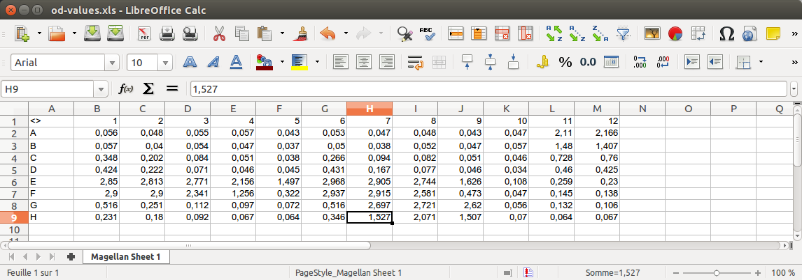
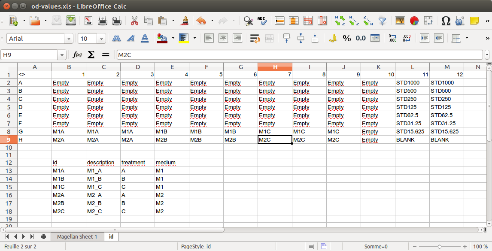

<!-- README.md is generated from README.Rmd. Please edit that file -->

```{r, echo = FALSE}
knitr::opts_chunk$set(
  collapse = TRUE,
  comment = "#>",
  fig.path = "README-"
)
```

# elisar

[](https://travis-ci.org/koncina/elisar)
[](https://ci.appveyor.com/project/koncina/elisar)
[](https://codecov.io/gh/koncina/elisar)


The goal of elisar is to handle Tecan Sunrise excel exports which were modified to include the plate layout and sample identifications. It will perform a 4PL regression (using the `drc` library) and return a dataframe containing the concentrations corresponding to the O.D. values.

## Installation

You can install elisar from github with:

```{r gh-installation, eval = FALSE}
# install.packages("devtools")
devtools::install_github("koncina/elisar")
```

## Example

### Prepare the Excel files

1. Export Tecan sunrise results as MS Excel `.xls` files.
2. Open the file (an example is shown in the screenshots below), duplicate the sheet and optionally rename it (e.g. `id`).
3. On the duplicated sheet replace the O.D. values by unique identifiers for each sample and standard.
  - The standard values are constructed with a common leading `std_key` id (defaults to `STD_` but can be adjusted in the `elisa_analyse()` function) merged to a trailing concentration value. For example: 250, 500 and 1000 pg/ml standard points would be encoded as STD_250, STD_500 and STD_1000 (see wells in rows A-G and columns 11 to 12 in the second screenshot below).
4. It is possible to extend the identifications by placing a second table below the layout. The table should contain headers and requires the mandatory column `id` which should list all IDs reported in the layout. One can add as much columns as required to fully describe the data.

#### Screenshots

_Original Tecan Excel file: _



_Modified Tecan Excel file to include sample identifications:_


### Import the file in _R_

```{r input}
library(elisar)
example <- system.file("extdata", "example.xls", package="elisar")
(input <- read_plate(example))
```

### Perform the regression

```{r analyse}
df <- elisa_analyse(input)
df
```

The `elisa_analyse()` function performs a 4 parameter logistic regression (using `drc::drm()`) and returns a dataframe with the calculated concentration values.
**Note** that a warning is displayed when O.D. values are not within the range of standard points. These values are tagged as FALSE in the `in_range` column.

The `extract_standard()` function extracts the standard points from the dataframe (converting the dose values encoded in the id column to numbers)

```{r, warning = FALSE, message = FALSE}
extract_standard(input, od, concentration)
```

The `extract_standard()` output can easily be integrated in `ggplot()` to render the regression curve (using `elisar::stat_4pl()` to draw the `drc::drm()` 4PL regression model).

```{r standard, warning = FALSE}
library(ggplot2)
library(scales)

ggplot(extract_standard(df),
       aes(x = x, y = log10(y))) +
  scale_x_log10() +
  annotation_logticks(sides = "b") +
  geom_point(size = 3) +
  stat_4pl(color = "red", size = 1) +
  xlab("Concentration in pg/ml") +
  theme_bw()
```
