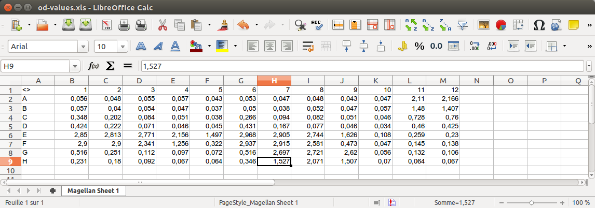

```{r, echo = FALSE, warning = FALSE}
library(knitr)
opts_knit$set(root.dir = "./example/")
```

> ElisaR can handle Tecan Sunrise excel exports which were modified to include the plate layout and sample identifications. It will perform a 4PL regression (using the `drc` library) and return a dataframe containing the concentrations corresponding to the O.D. values.

## Installation

```
devtools::install_git('https://github.com/koncina/elisar.git')
```

## Usage

### Prepare the Excel files

1. Export Tecan sunrise results as MS Excel `.xls` files.
2. Open the file (an example is shown in the screenshots below), duplicate the sheet and optionally rename it (e.g. `id`). The layout sheet **must be placed after** the original sheet.
3. On the duplicated sheet replace the O.D. values by unique identifiers for each sample and standard.
  - Unused wells can be specified by `empty` (case insensitive)
  - The blank value is specified by `blank` (case insensitive)
  - The standard values are constructed with a common leading `std.key` id (defaults to `STD` but can be adjusted in the `elisa.analyse()` function) merged to a trailing concentration value. For example: 250, 500 and 1000 pg/ml standard points would be encoded as STD250, STD500 and STD1000 (see wells in rows A-G and columns 11 to 12 in the second screenshot below).
4. It is possible to extend the identifications by placing a second table either below the layout or on a third sheet. The table should contain headers and requires the mandatory column `id` which should list all IDs reported in the layout. One can add as much columns as required to fully describe the data.

#### Screenshots

*Original Tecan Excel file:*


*Modified Tecan Excel file to include sample identifications:*


### Import the file in _R_

```{r input}
library(elisar)
input <- read.tecan("od-values.xls")
input
```

### Perform the regression

```{r analyse}
df <- elisa.analyse(input, transform = TRUE)
names(df)
```

The `elisa.analyse()` function returns a list containing the standard curve (used by the `elisa.standard()` function which will render it) and a dataframe with the analysed values.
**Note** that a warning is displayed when O.D. values are not within the range of standard points. These values are tagged as FALSE in the `.valid` column.

```{r, echo = FALSE}
options(dplyr.width = Inf)
```

```{r data}
head(df$data)
```

```{r standard, warning = FALSE, message = FALSE}
elisa.standard(df)
```

### Options for the regression

Some options of the `elisa.analyse()` can be adjusted. Refer to the help page to list them (`?elisa.analyse`).

## Known issues

During the testing phase using MS Excel 97-2003 files (*xls* extension), `readxl::read_excel()` sometimes imported cells containing text as "0.00" text values. The `read.tecan()` function should detect and correct wrongly imported cells. As `readxl` users report other [issues](https://github.com/hadley/readxl/issues) when dealing with Excel 97-2003 files, it is recommended to convert the Tecan Sunrise Excel files to the MS Excel 2007-2013 XML format (*xlsx* extension) after adding the layout and identification informations.

