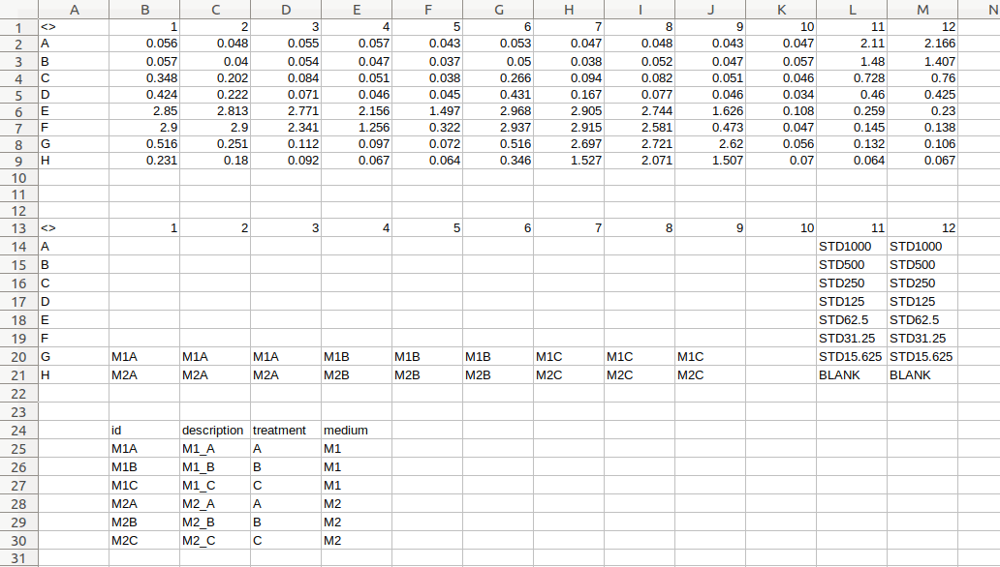
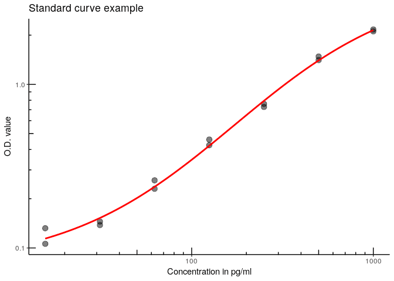

<!-- README.md is generated from README.Rmd. Please edit that file -->
elisar
======

[](https://travis-ci.org/koncina/elisar) [](https://ci.appveyor.com/project/koncina/elisar) [](https://codecov.io/gh/koncina/elisar)

The goal of elisar is to handle Tecan Sunrise excel exports which were modified to include the plate layout and sample identifications. It will perform a 4PL regression (using the `drc` library) and return a data frame containing the concentrations corresponding to the O.D. values.

Installation
------------

You can install elisar from github with:

``` r
# install.packages("devtools")
devtools::install_github("koncina/elisar")
```

Example
-------

### Prepare the Excel files

1.  Export Tecan sunrise results as MS Excel `.xls` files.
2.  Add the layout (column names from `1` to `12` and row names from `A` to `H`) to fill in the IDs for each deposited sample.
    -   Plate the layout plate on the same sheet, another sheet in the same file or even in another excel file.
    -   The standard values are constructed with a common leading `std_key` id (defaults to `STD` but can be adjusted in the `elisa_analyse()` function) merged to a trailing concentration value. For example: 250, 500 and 1000 pg/ml standard points would be encoded as STD250, STD500 and STD1000 (see wells in rows A-G and columns 11 to 12 in the screenshot below).
3.  Add an optional table to extend the identifications. The table should contain the mandatory column `id` listing all IDs reported in the layout. One can add as much columns as required to fully describe the data.

*Example of a modified Excel file: *



### Import the file in *R*

Use the `read_plate()` to read in the O.D. values together with the IDs and extended informations as a data frame.
A vector containing multiple files can be passed to `read_plate()`: These files can contain multiple data plates (O.D. values) but only a single layout and ID table should be present among all files.

``` r
library(tidyverse)
library(elisar)

elisar_example() %>%
  read_plate() %>%
  glimpse()
#> Observations: 96
#> Variables: 10
#> $ file        <chr> "example.xls", "example.xls", "example.xls", "exam...
#> $ sheet       <chr> "Magellan Sheet 1", "Magellan Sheet 1", "Magellan ...
#> $ element     <chr> "(1, 1)", "(1, 1)", "(1, 1)", "(1, 1)", "(1, 1)", ...
#> $ row         <chr> "G", "G", "G", "H", "H", "H", "G", "G", "G", "H", ...
#> $ col         <int> 1, 2, 3, 1, 3, 2, 5, 6, 4, 4, 6, 5, 8, 7, 9, 9, 8,...
#> $ id          <chr> "M1A", "M1A", "M1A", "M2A", "M2A", "M2A", "M1B", "...
#> $ value       <dbl> 0.516, 0.251, 0.112, 0.231, 0.092, 0.180, 0.072, 0...
#> $ description <chr> "M1_A", "M1_A", "M1_A", "M2_A", "M2_A", "M2_A", "M...
#> $ treatment   <chr> "A", "A", "A", "A", "A", "A", "B", "B", "B", "B", ...
#> $ medium      <chr> "M1", "M1", "M1", "M2", "M2", "M2", "M1", "M1", "M...
```

### Perform the regression

``` r
elisar_example() %>%
  read_plate() %>%
  elisa_analyse() %>%
  glimpse()
#> Warning: 15 OD values are outside the standard range
#> Observations: 96
#> Variables: 13
#> $ file             <chr> "example.xls", "example.xls", "example.xls", ...
#> $ sheet            <chr> "Magellan Sheet 1", "Magellan Sheet 1", "Mage...
#> $ element          <chr> "(1, 1)", "(1, 1)", "(1, 1)", "(1, 1)", "(1, ...
#> $ row              <chr> "G", "G", "G", "H", "H", "H", "G", "G", "G", ...
#> $ col              <int> 1, 2, 3, 1, 3, 2, 5, 6, 4, 4, 6, 5, 8, 7, 9, ...
#> $ id               <chr> "M1A", "M1A", "M1A", "M2A", "M2A", "M2A", "M1...
#> $ value            <dbl> 0.516, 0.251, 0.112, 0.231, 0.092, 0.180, 0.0...
#> $ description      <chr> "M1_A", "M1_A", "M1_A", "M2_A", "M2_A", "M2_A...
#> $ treatment        <chr> "A", "A", "A", "A", "A", "A", "B", "B", "B", ...
#> $ medium           <chr> "M1", "M1", "M1", "M2", "M2", "M2", "M1", "M1...
#> $ estimate         <dbl> 159.998395, 70.308342, 5.933014, 62.798726, 0...
#> $ estimate_std_err <dbl> 9.880593, 6.329615, 1.879901, 6.192559, NA, 5...
#> $ in_range         <lgl> TRUE, TRUE, TRUE, TRUE, TRUE, TRUE, TRUE, TRU...
```

The `elisa_analyse()` function performs a 4 parameter logistic regression (using `drc::drm()`) and returns a data frame with the calculated concentration values.
A warning is displayed when O.D. values are outside the standard curve range. These values will be tagged as `FALSE` in the `in_range` column.

The `extract_standard()` function extracts the standard points from the data frame (converting the dose values encoded in the id column to numbers)

``` r
elisar_example() %>%
  read_plate() %>%
  extract_standard(concentration, od) %>%
  arrange(concentration)
#> # A tibble: 14 x 2
#>    concentration    od
#>            <dbl> <dbl>
#>  1          15.6 0.132
#>  2          15.6 0.106
#>  3          31.2 0.145
#>  4          31.2 0.138
#>  5          62.5 0.259
#>  6          62.5 0.230
#>  7         125.  0.460
#>  8         125.  0.425
#>  9         250.  0.728
#> 10         250.  0.760
#> 11         500.  1.48 
#> 12         500.  1.41 
#> 13        1000.  2.11 
#> 14        1000.  2.17
```

To render the regression curve, the output of `extract_standard()` can be used by `ggplot()` (with the `elisar::stat_4pl()` layer to draw the `drc::drm()` 4PL regression model).

``` r
elisar_example() %>%
  read_plate() %>%
  extract_standard() %>%
  ggplot(aes(x = concentration, y = od)) +
  scale_y_log10() +
  scale_x_log10() +
  annotation_logticks(sides = "lb") +
  geom_point(size = 3, alpha = 0.5) +
  stat_4pl(color = "red", size = 1) +
  labs(title = "Standard curve example",
       x = "Concentration in pg/ml",
       y = "O.D. value") +
  theme_classic()
#> adjusting drc::drm logDose to 10
```


