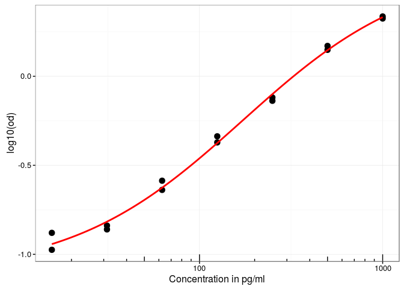

# ElisaR

[](https://travis-ci.org/koncina/elisar)
[](https://ci.appveyor.com/project/koncina/elisar)
[](https://codecov.io/github/koncina/elisar?branch=master)


> ElisaR can handle Tecan Sunrise excel exports which were modified to include the plate layout and sample identifications. It will perform a 4PL regression (using the `drc` library) and return a dataframe containing the concentrations corresponding to the O.D. values.

## Installation

```
devtools::install_git('https://github.com/koncina/elisar.git')
```

## Usage

### Prepare the Excel files

1. Export Tecan sunrise results as MS Excel `.xls` files.
2. Open the file (an example is shown in the screenshots below), duplicate the sheet and optionally rename it (e.g. `id`).
3. On the duplicated sheet replace the O.D. values by unique identifiers for each sample and standard.
  - Unused wells can be specified by the keyword `empty` (case insensitive)
  - The blank value is specified by the keyword `blank` (case insensitive)
  - The standard values are constructed with a common leading `std.key` id (defaults to `STD` but can be adjusted in the `elisa.analyse()` function) merged to a trailing concentration value. For example: 250, 500 and 1000 pg/ml standard points would be encoded as STD250, STD500 and STD1000 (see wells in rows A-G and columns 11 to 12 in the second screenshot below).
4. It is possible to extend the identifications by placing a second table below the layout. The table should contain headers and requires the mandatory column `id` which should list all IDs reported in the layout. One can add as much columns as required to fully describe the data.

#### Screenshots

*Original Tecan Excel file:*


*Modified Tecan Excel file to include sample identifications:*


### Import the file in _R_


```r
library(elisar)
example <- system.file("extdata", "example_full.xls", package="elisar")
input <- read.plate(example)
```

```
## readxl returned a dataframe without column names (NA): Trying a workaround
```

```r
input
```

```
## Source: local data frame [34 x 9]
## 
##                file   row column    id description treatment medium
##               <chr> <chr>  <chr> <chr>       <chr>     <chr>  <chr>
## 1  example_full.xls     G      1   M1A        M1_A         A     M1
## 2  example_full.xls     H      1   M2A        M2_A         A     M2
## 3  example_full.xls     G      2   M1A        M1_A         A     M1
## 4  example_full.xls     H      2   M2A        M2_A         A     M2
## 5  example_full.xls     G      3   M1A        M1_A         A     M1
## 6  example_full.xls     H      3   M2A        M2_A         A     M2
## 7  example_full.xls     G      4   M1B        M1_B         B     M1
## 8  example_full.xls     H      4   M2B        M2_B         B     M2
## 9  example_full.xls     G      5   M1B        M1_B         B     M1
## 10 example_full.xls     H      5   M2B        M2_B         B     M2
## ..              ...   ...    ...   ...         ...       ...    ...
## Variables not shown: sheet <chr>, value <dbl>.
```

### Perform the regression


```r
df <- elisa.analyse(input)
```

```
## 3 OD values are outside the standard range
```

```r
df
```

```
## elisa.analyse() concentration values obtained from the OD with the following 4PL regression(s):
## 
##               file Slope:(Intercept) Lower:(Intercept) Upper:(Intercept)
## 1 example_full.xls          -1.38447         0.1070846          3.200827
##   ED50:(Intercept)
## 1         622.9272
## 
## Source: local data frame [34 x 12]
## 
##                file column   row    id description treatment medium
##               <chr>  <chr> <chr> <chr>       <chr>     <chr>  <chr>
## 1  example_full.xls      1     G   M1A        M1_A         A     M1
## 2  example_full.xls      1     H   M2A        M2_A         A     M2
## 3  example_full.xls      2     G   M1A        M1_A         A     M1
## 4  example_full.xls      2     H   M2A        M2_A         A     M2
## 5  example_full.xls      3     G   M1A        M1_A         A     M1
## 6  example_full.xls      3     H   M2A        M2_A         A     M2
## 7  example_full.xls      4     G   M1B        M1_B         B     M1
## 8  example_full.xls      4     H   M2B        M2_B         B     M2
## 9  example_full.xls      5     G   M1B        M1_B         B     M1
## 10 example_full.xls      5     H   M2B        M2_B         B     M2
## ..              ...    ...   ...   ...         ...       ...    ...
## Variables not shown: sheet <chr>, value <dbl>, concentration <dbl>,
##   concentration.sd <dbl>, .valid <lgl>.
```

The `elisa.analyse()` function performs a 4 parameter logistic regression (using `drc::drm()`) and returns a dataframe with the calculated concentration values.
**Note** that a warning is displayed when O.D. values are not within the range of standard points. These values are tagged as FALSE in the `.valid` column.


```r
head(df)
```

```
## Source: local data frame [6 x 12]
## 
##               file column   row    id description treatment medium
##              <chr>  <chr> <chr> <chr>       <chr>     <chr>  <chr>
## 1 example_full.xls      1     G   M1A        M1_A         A     M1
## 2 example_full.xls      1     H   M2A        M2_A         A     M2
## 3 example_full.xls      2     G   M1A        M1_A         A     M1
## 4 example_full.xls      2     H   M2A        M2_A         A     M2
## 5 example_full.xls      3     G   M1A        M1_A         A     M1
## 6 example_full.xls      3     H   M2A        M2_A         A     M2
##              sheet value concentration concentration.sd .valid
##              <chr> <dbl>         <dbl>            <dbl>  <lgl>
## 1 Magellan Sheet 1 0.516    159.998395         9.880593   TRUE
## 2 Magellan Sheet 1 0.231     62.798726         6.192559   TRUE
## 3 Magellan Sheet 1 0.251     70.308342         6.329615   TRUE
## 4 Magellan Sheet 1 0.180     42.292176         5.570530   TRUE
## 5 Magellan Sheet 1 0.112      5.933014         1.879901   TRUE
## 6 Magellan Sheet 1 0.092      0.000000              NaN   TRUE
```

The `elisa.standard()` function extracts the standard points from the dataframe (converting the dose values encoded in the id column to numbers)


```r
elisa.standard(df)
```

```
## Source: local data frame [14 x 6]
## Groups: file [1]
## 
##                file column   row        id        x value
##               (chr)  (chr) (chr)     (chr)    (dbl) (dbl)
## 1  example_full.xls     11     A   STD1000 1000.000 2.110
## 2  example_full.xls     11     B    STD500  500.000 1.480
## 3  example_full.xls     11     C    STD250  250.000 0.728
## 4  example_full.xls     11     D    STD125  125.000 0.460
## 5  example_full.xls     11     E   STD62.5   62.500 0.259
## 6  example_full.xls     11     F  STD31.25   31.250 0.145
## 7  example_full.xls     11     G STD15.625   15.625 0.132
## 8  example_full.xls     12     A   STD1000 1000.000 2.166
## 9  example_full.xls     12     B    STD500  500.000 1.407
## 10 example_full.xls     12     C    STD250  250.000 0.760
## 11 example_full.xls     12     D    STD125  125.000 0.425
## 12 example_full.xls     12     E   STD62.5   62.500 0.230
## 13 example_full.xls     12     F  STD31.25   31.250 0.138
## 14 example_full.xls     12     G STD15.625   15.625 0.106
```

The `elisa.standard()` output can easily be integrated in `ggplot()` to render the regression curve (using `elisar::stat_4pl()` to draw the `drc::drm()` 4PL regression model).


```r
library(dplyr, warn.conflicts = FALSE)
library(ggplot2)
library(scales)
df %>%
  elisa.standard() %>%
  rename(od = value) %>%
  ggplot(aes(x = x, y = log10(od))) +
  scale_x_log10() +
  annotation_logticks(sides = "b") +
  geom_point(size = 3) +
  stat_4pl(color = "red", size = 1) +
  xlab("Concentration in pg/ml") +
  theme_bw()
```

<!-- -->

### Options for the regression

Some options of the `elisa.analyse()` function can be adjusted. Refer to the help page to list them (`?elisa.analyse`).
